♻️ Recycle Hub

Recycle Hub is a full-stack web application designed to encourage sustainable living by allowing users to donate, exchange, and discover reusable items within their community. The platform helps reduce waste while promoting eco-friendly practices through a simple and user-friendly interface.

🚀 Features

- 👤 User Registration and Login
- 🔐 Secure Authentication
- 📦 Add and Manage Recyclable Items
- 🗄️ MySQL Database Integration
- 🌐 REST API using Node.js & Express
- 📱 Responsive User Interface
- ⚡ Fast frontend powered by Vite
- 🌱 Promotes sustainable and eco-friendly item exchange
 🛠️ Tech Stack
**Frontend**
- React.js
- TypeScript
- Tailwind CSS
- Vite

**Backend**
- Node.js
- Express.js

**Database**
- MySQL

**Tools**
- Git
- GitHub
- VS Code

 📂 Project Structure
project/
│── backend/
│   ├── server.js
│   ├── package.json
│   ├── .env.example
│   └── node_modules/
│
│── screenshots/
│   ├── 01-Home.png
│   ├── 02-login.png
│   ├── 03-signup.png
│   ├── 04-items list.png
│   ├── 05-Drop points.png
│   ├── 06-drop points(2).png
│   ├── 07-factories.png
│   ├── 08-factories(2).png
│   ├── 09-volunteers.png
│   ├── 10-volunteers(2).png
│   └── 11-contact.png
│
│── src/
│── public/
│── package.json
│── vite.config.ts
│── tailwind.config.js
└── README.md

**Installation**

**Clone Repository**

bash
git clone https://github.com/yourusername/recycle-hub.git

**Install Frontend Dependencies**

bash
npm install

 **Install Backend Dependencies**
bash
cd backend
npm install

**Create Environment Variables**

Create a `.env` file inside the `backend` folder.

DB_HOST=127.0.0.1
DB_USER=root
DB_PASSWORD=YOUR_PASSWORD
DB_NAME=user
PORT=5000

Run Backend

bash
node server.js

**Run Frontend**

bash
npm run dev

**Screenshots**

**Home**
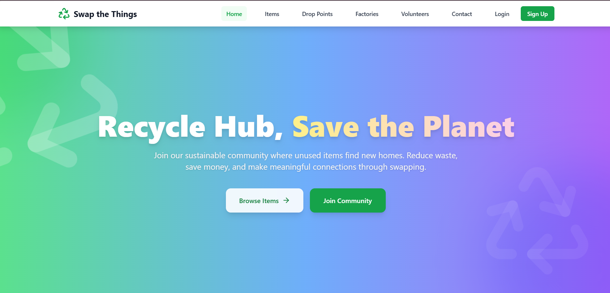
**Login**
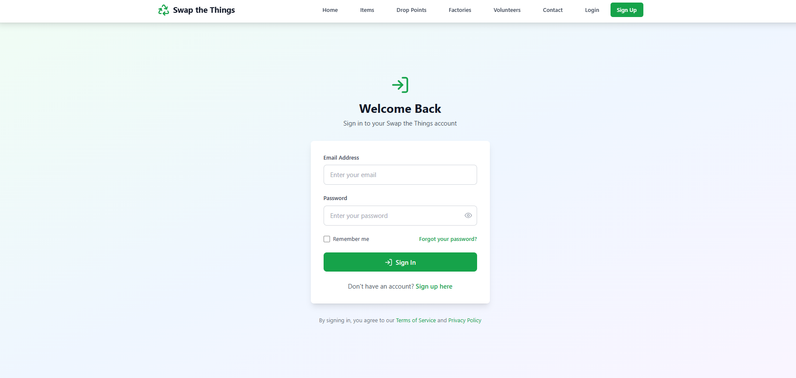
**signup**
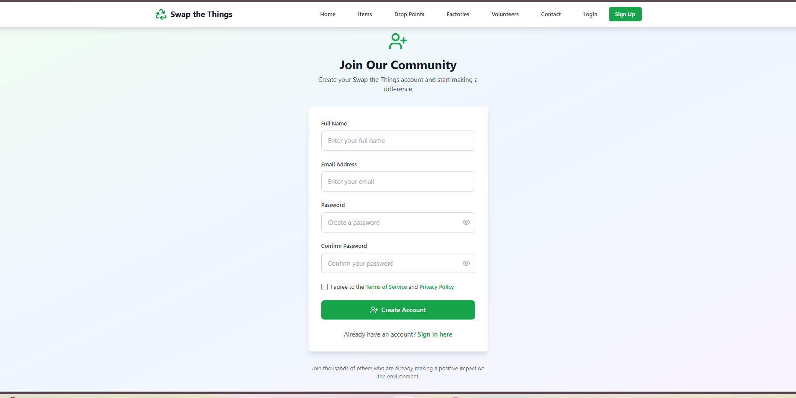
**items-list**
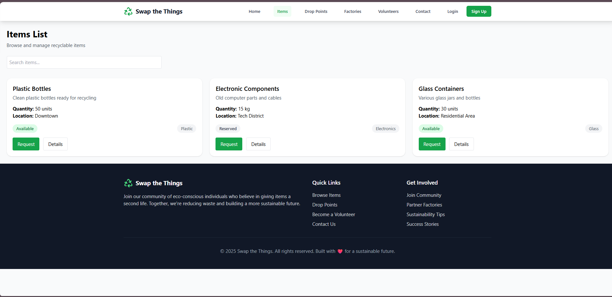
**drop-list**
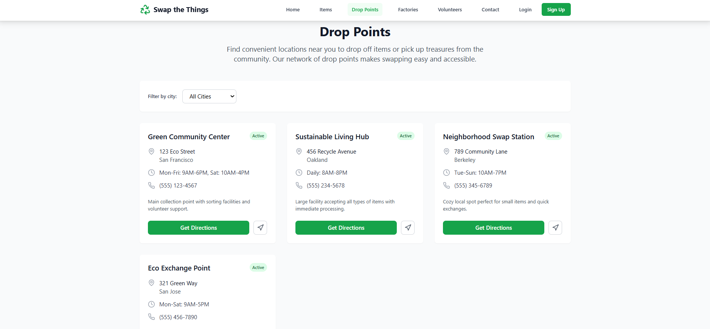
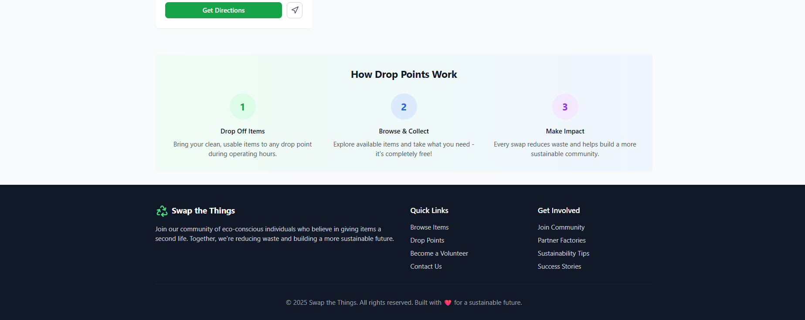
**factories**
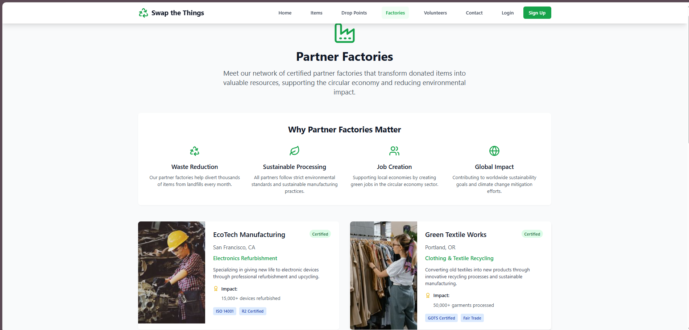
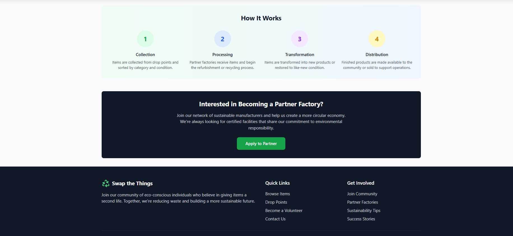
**volunteers**
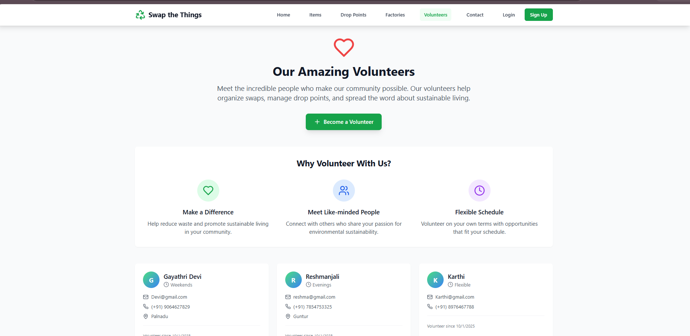
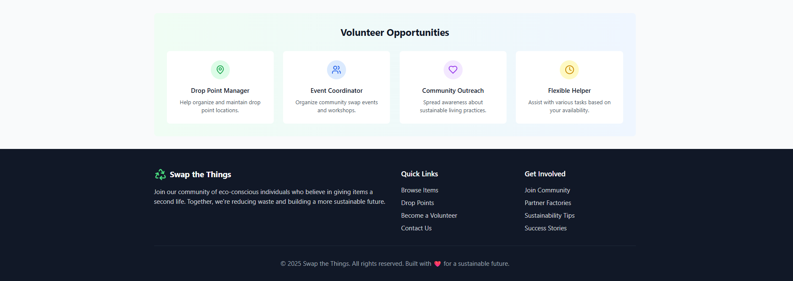
**contact**
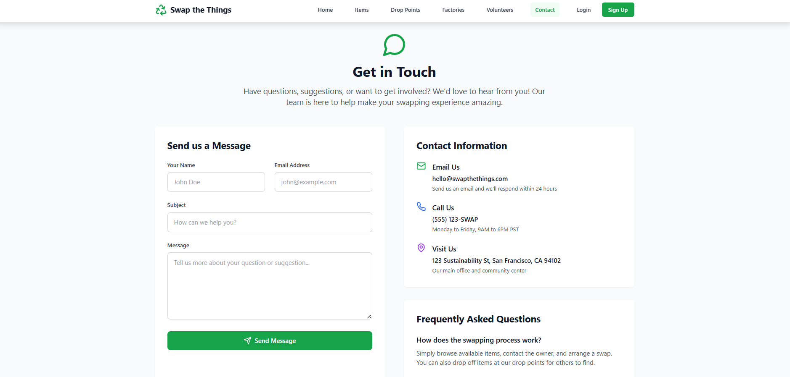

 **Future Enhancements**

- User Profile Management
- Item Image Upload & Gallery
- Advanced Search & Category Filters
- Wishlist & Favorite Items
- Real-Time Chat Between Users
- Item Swap Request & Approval System
- Email & In-App Notifications
- Location-Based Nearby Drop Points
- Admin Dashboard for User & Item Management
- Analytics & Recycling Impact Dashboard
- JWT Authentication & Password Encryption
- Cloud Image Storage (Cloudinary/AWS S3)
- Mobile Responsive & PWA Support

**👩‍💻 Author**

**Gayathri Devi**

If you like this project, consider giving it a ⭐ on GitHub.
